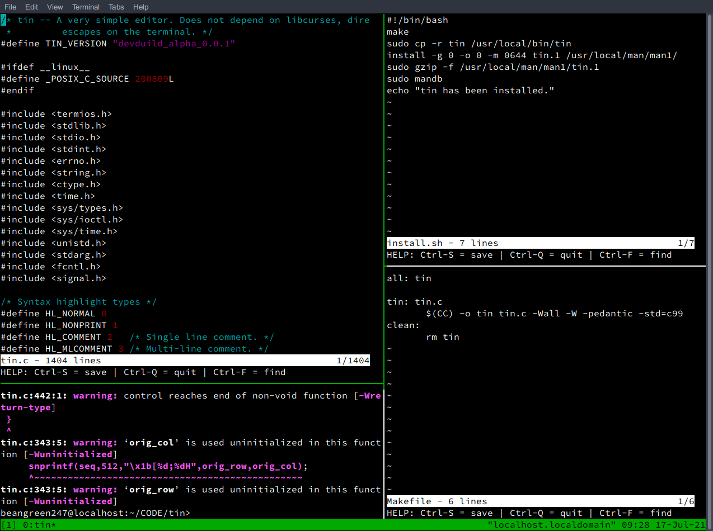

tin
===

|name|version|state|
|:---:|:---:|:---:|
|tin|devduild_alpha_0.0.1|testing|

States explained

* stable - fully working release
* unstable - somewhat working, with a few bugs
* testing - developing and testing new features

Screen

In this screen you can me by "IDE" setup with 3 instances of tin.

Usage: tin `<filename>`

Features

Supported languages (more will be added)

* C
* C++
* Python

Cursor movement can be done via keyboard arrows or mouse scroll. Mouse click into set position not supported, at will not be implemented.

TIP
> If you want the best experience using this editor as an IDE, I would recommend running multiple instances of it using tmux. At least that is how I use it.

Keys:

* CTRL-S: Save
* CTRL-Q: Quit
* CTRL-F: Find string in file (ESC to exit search, arrows to navigate)

tin does not depend on any library (not even curses). It uses fairly standard
VT100 (and similar terminals) escape sequences. The project is in alpha
stage.

If you want to know more about VT100 escape sequences [go here](https://espterm.github.io/docs/VT100%20escape%20codes.html).

People are encouraged to use it as a starting point to write other editors or command line interfaces that are more advanced than the usual REPL style CLI.

To install
```bash
sudo bash install.sh
```
To uninstall
```bash
sudo bash uninstall.sh
```
